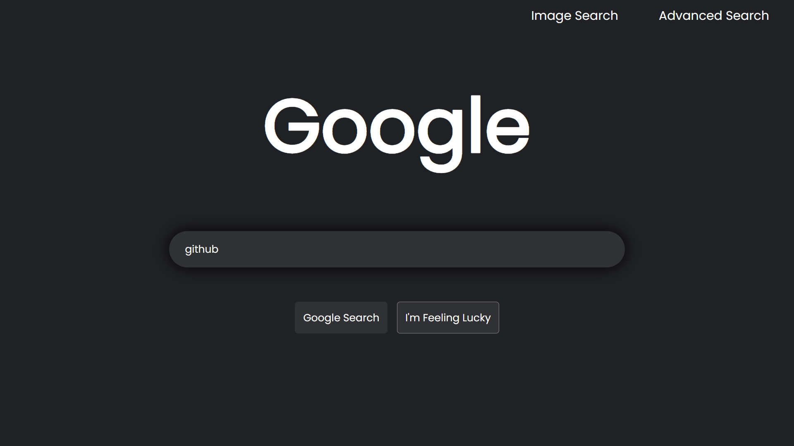

# web50-search
[Video demo](https://youtu.be/CutSNPBC2MI) | [Link to Github Pages](https://shashwatb14.github.io/web50-search/)

---

---

## Description

A front-end design for Google Search, Google Image Search, and Google Advanced Search as Project 0 for CS50's Web Programming with Python and JavaScript.

This website closely resembles Google's design and has all the essential features of Google Search, Image Search, and Advanced Search, organized into three distinct pages, each with a simple and plain design.

The rounded and center-positioned search box allows users to enter a query, choose "Google Search," and be taken to the Google results page. The "I'm Feeling Lucky" button lets users to bypass the search results and go directly to the first Google search result that suits their query. The upper-right corner of the page has links to the sites for Image Search and Advanced Search.

While the Advanced Search page has four text fields that let users find pages with "all these words", "this specific word or phrase", "any of these words", or "none of these words", the Google Image Search page allows users to input a query and search for relevant images.

This website's CSS closely mimics Google's own aesthetics.  The website offers users all the essential features of Google Search, Image Search, and Advanced Search in a single, user-friendly platform that is simple to navigate and intuitive to use.
